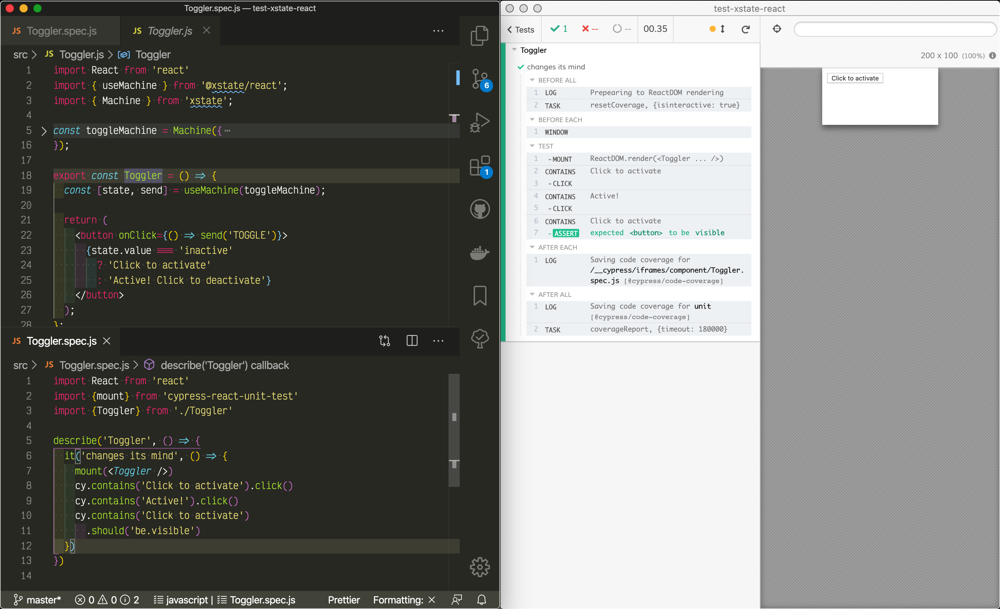

# test-xstate-react
> XState component testing using Cypress

  

Toggle example from [xstate-react intro](https://xstate.js.org/docs/packages/xstate-react/) tested using [cypress-react-unit-test v2](https://github.com/bahmutov/cypress-react-unit-test/pull/108)

Also read [Access XState from Cypress Test](https://glebbahmutov.com/blog/cypress-and-xstate/)
